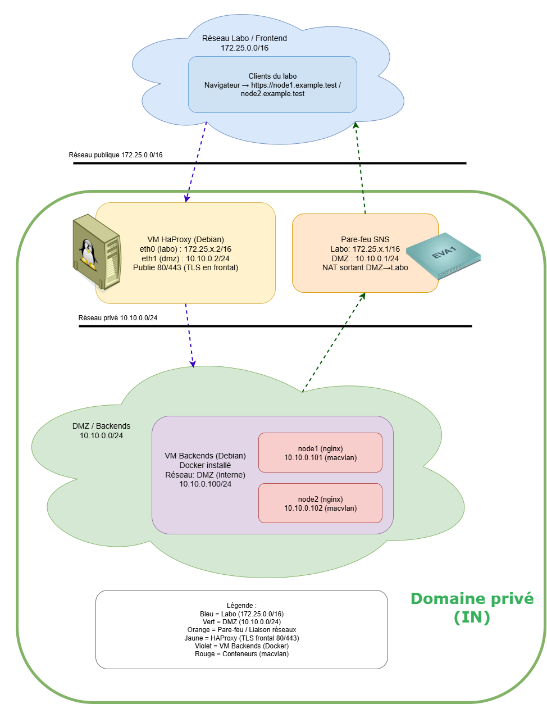

import { Aside, Steps } from '@astrojs/starlight/components';

## Objectifs

<Aside type="note">
**Objectif** : Mettre en place l'infrastructure réseau et valider la connectivité.

**Scope de cette partie** : VirtualBox, VMs, réseaux virtuels, adressage IP, pare-feu SNS, routage.
**Hors scope** : Configuration d'HAProxy, installation de Docker, déploiement de conteneurs.

À la fin de cette partie :
- ✅ Les trois VMs (SNS, haproxy, backends) sont câblées et adressées
- ✅ Connectivité validée entre Labo ↔ SNS ↔ DMZ
- ❌ HAProxy n'est pas encore configuré
- ❌ Docker n'est pas encore installé
</Aside>

---

# 1. Prérequis

Avant de commencer, vérifiez que vous disposez de :

- **VirtualBox** (dernière version installée).
- Les fichiers d'appliance :
   - pour le pare-feu Stormshield SNS EVA1
   - Un serveur Debian utilisé dans les activités pratiques habituelles.
- Votre numéro d'étudiant **x**, utilisé pour les adresses IP du réseau labo : `172.25.x.0/16`.

<Aside type="note">
Une *appliance* est une machine virtuelle livrée « clé en main » : le système d'exploitation et le logiciel sont déjà installés et pré-configurés. Elle se distribue sous forme d'un fichier `.ova` que VirtualBox importe directement, sans installation manuelle.
</Aside>

---

# 2. Topologie cible



## Les machines utilisées

L'environnement virtuel comportera **trois machines** :

| Machine               | Rôle                                                    | Réseaux connectés | Adresse(s)                               |
| --------------------- | ------------------------------------------------------- | ----------------- | ---------------------------------------- |
| **SNS (pare-feu)**    | Assure la séparation et le NAT entre le labo et la DMZ  | Labo + DMZ        | `172.25.x.1` (labo)  /  `10.10.0.1` (DMZ) |
| **haproxy (Debian)**  | Proxy inverse côté labo, accès aux backends dans la DMZ | Labo + DMZ        | `172.25.x.2` (labo)  /  `10.10.0.2` (DMZ) |
| **backends (Debian)** | Hôte Docker pour les serveurs web `node1` et `node2`    | DMZ uniquement    | `10.10.0.100`                             |

<Aside type="note">
**Pourquoi avoir à la fois HAProxy et un pare-feu SNS ?**

Les deux équipements remplissent des rôles différents et complémentaires :

- **HAProxy** est un *reverse proxy* : il reçoit les requêtes HTTP/HTTPS des clients et les redistribue vers les bons serveurs web. Il n'expose que les ports 80 et 443 ; les backends restent invisibles depuis le réseau labo.
- **SNS** est le pare-feu/routeur de la DMZ : il permet aux serveurs de la DMZ d'accéder à Internet pour les mises à jour (NAT sortant), et autorise l'administration SSH des VMs depuis le labo, ce que HAProxy ne gère pas.
</Aside>

## Réseaux utilisés

| Zone                | Rôle                                                                   | Plage IP                                      |
| ------------------- | ---------------------------------------------------------------------- | --------------------------------------------- |
| **Labo / Frontend** | Simule Internet (réseau externe non maîtrisé) : poste étudiant → HAProxy | `172.25.0.0/16` (sous-espace `172.25.x.0/16`) |
| **DMZ / backends**  | Serveurs web internes protégés, jamais exposés directement             | `10.10.0.0/24`                                 |

<Aside type="tip">
Dans ce TP, le réseau Labo joue le rôle d'**Internet** : il représente un réseau externe, non maîtrisé, depuis lequel un client quelconque pourrait tenter d'accéder à vos services. C'est ce qui rend la séparation Labo / DMZ réaliste : les backends ne doivent **jamais** être joignables directement depuis ce réseau, exactement comme un vrai serveur web ne doit pas être exposé directement sur Internet.
</Aside>

<Aside type="caution">
Les backends ne seront jamais exposés directement au réseau labo (simultation d'internet).

Seul **HAProxy** sera exposé (ports 80 et 443).
</Aside>

---

# 3. Importer les appliances VirtualBox

## a) Importer le pare-feu SNS

1. Ouvrez **VirtualBox** → **Fichier ▸ Importer un appareil virtuel**.
2. Sélectionnez le fichier `.ova`.
3. Avant de valider l'import, renommez la VM en `SNS` dans le champ « Nom ».

---

## b) Importer la VM Debian

1. Importez la VM Debian.
2. **Renommez-la** en `haproxy`.
3. **Clonez-la** (clone lié) et renommez le clone en `backends`.

<Aside type="tip">
Le clone lié permet d'économiser de l'espace disque.

Ne déplacez pas les VMs sur une autre machine après importation.
</Aside>

---

## 4. Configurer les interfaces réseau

## a) VM **haproxy**

| Adaptateur | Mode                        | Rôle                                |
| ---------- | --------------------------- | ----------------------------------- |
| 1          | **Accès par pont (_Bridge_)** | Vers le réseau labo `172.25.x.0/16` |
| 2          | **Réseau interne : `vboxnet_dmz`**  | Vers les backends                   |

---

## b) VM **backends**

| Adaptateur | Mode                       | Rôle                | Options                          |
| ---------- | -------------------------- | ------------------- | -------------------------------- |
| 1          | **Réseau interne : `vboxnet_dmz`** | Vers haproxy et SNS | Mode promiscuité : « Allow All » |

Pour permettre au réseau Docker (macvlan) de fonctionner correctement, l'interface réseau de la VM **backends** doit être **configurée en mode promiscuité**.

- **Le mode promiscuité**

   Cette configuration est nécessaire pour que Docker puisse créer des interfaces virtuelles avec leurs propres adresses MAC sur le réseau macvlan.

   <Aside type="note">
   Le **mode promiscuité** permet à l'interface réseau de recevoir tous les paquets du réseau, pas seulement ceux destinés à son adresse MAC. C'est indispensable pour que les conteneurs Docker avec le driver réseau macvlan puissent communiquer correctement.
   </Aside>

---

## c) VM **SNS**

| Adaptateur | Mode                       | Rôle                                                                                  |
| ---------- | -------------------------- | ------------------------------------------------------------------------------------- |
| 1          | **Bridge (Labo)**          | Interface externe vers `172.25.x.0/16`                                                |
| 2          | (réservé, ne pas modifier) | Débrancher le câble. On n'utilisera pas cette interface réservé au réseau « utilisateur » |
| 3          | **Réseau interne : `vboxnet_dmz`** | Interface interne vers `10.10.0.0/24`                                                  |

---

# 5. Adressage IP

## a) Plan d'adressage de référence

| Zone (réseau) | Machine                   | Adresse                |
| ------------- | ------------------------- | ---------------------- |
| Labo          | Passerelle labo (gateway) | `172.25.254.254`       |
| Labo          | SNS (ext.)                | `172.25.x.1`           |
| Labo          | haproxy (ext.)            | `172.25.x.2`           |
| DMZ           | SNS (int.)                | `10.10.0.1`             |
| DMZ           | haproxy (int.)            | `10.10.0.2`             |
| DMZ           | backends                  | `10.10.0.100`           |
| (plus tard)   | Conteneurs : node1/node2  | `10.10.0.101` et `.102` |

---

## b) Configurer les interfaces sur **haproxy**

<Aside type="note">
L'ensemble des configurations qui peuvent être effectuées en utilisant la commande `nmcli` en ligne de commande peuvent également être réalisées de manière plus intuitive et conviviale en passant par l'interface utilisateur en mode texte `nmtui`, qui offre une approche plus visuelle et guidée pour la gestion des connexions réseau.
</Aside>

Identifiez les interfaces :

```bash
ip -br a
# ou, si NetworkManager est présent :
nmcli device status
```

Renommez les profils pour plus de clarté :

```bash
sudo nmcli connection show
sudo nmcli con mod "Connexion filaire 1" connection.id labo
sudo nmcli con mod "Connexion filaire 2" connection.id dmz
```

Attribuez les adresses :

```bash
# Labo : 172.25.x.2/16, passerelle labo
sudo nmcli con mod labo ipv4.method manual \
  ipv4.addresses 172.25.<x>.2/16 ipv4.gateway 172.25.254.254 \
  ipv4.dns "172.25.254.254"
sudo nmcli con up labo

# DMZ : 10.10.0.2/24, sans route par défaut
sudo nmcli con mod dmz ipv4.method manual \
  ipv4.addresses 10.10.0.2/24 ipv4.never-default yes
sudo nmcli con up dmz
```

Vérifiez la table de routage :

```bash
ip r
```

Vous devez voir une **route par défaut** vers `172.25.254.254` et une **route directe** vers `10.10.0.0/24`.

---

## c) Configurer le pare-feu **SNS**


### Étape 1 — Adressage des interfaces (depuis l'interface Web SNS)

1. **Configurer l'interface DMZ** : `10.10.0.1/24`.
2. **Configurer l'interface Labo** : `172.25.x.1/16` avec passerelle par défaut `172.25.254.254`.

**Mini-test** (depuis haproxy) :

```bash
ping -c2 10.10.0.1
ping -c2 172.25.x.1
```

Attendu : OK

---

### Étape 2 — Activer le **DNS proxy** pour la DMZ

Objectif : les machines de la DMZ (backends, puis conteneurs) pourront **résoudre** les noms sans sortir en direct.

1. **DNS proxy** : **activer**.
2. **Forwarders** du SNS :
   - recommandé : **DNS du labo** `172.25.254.15` (ou les serveurs indiqués par l'enseignant) ;
   - à défaut (si autorisé) : récursifs publics (ex. **1.1.1.1**, **8.8.8.8**).
3. **ACL DNS** : autoriser **DMZ → SNS (port 53/udp, 53/tcp)**.

<Aside type="tip">
Une fiche dédiée détaille pas à pas la configuration du proxy cache DNS sur SNS : [Configuration du Proxy Cache DNS](activities/sns/proxy-dns).
</Aside>

**Mini-test**
Depuis **backends (10.10.0.100)** :

```bash
nslookup deb.debian.org 10.10.0.1
```

Attendu : une ou plusieurs **adresses IP**.

> Si `nslookup` n'est pas dispo :
> `getent hosts deb.debian.org` doit retourner une IP.

---

### Étape 3 — Activer le **NAT sortant (SNAT)** DMZ → Labo/Internet

But : permettre aux hôtes DMZ d'accéder à Internet (`apt`/`docker pull`) **via l'IP labo du SNS**.

1. Créer une règle **SNAT/Masquerade** :
   - **From** : DMZ `10.10.0.0/24`
   - **To** : Any (Internet/labo)
   - **NAT** : masquerading via interface **Labo**
2. **Filtrage** (si nécessaire selon ta politique) : autoriser **DMZ → Any** en sortie (temporaire).

<Aside type="tip">
Une fiche dédiée détaille pas à pas la configuration du NAT sortant sur SNS : [NAT sortant (SNAT) sur Stormshield SNS](activities/sns/nat-sortant-snat).
</Aside>

**Mini-test**
Depuis **backends** :

```bash
curl -I http://deb.debian.org
```

Attendu : `HTTP/1.1 200 OK` (résolution DNS + sortie Internet OK).

---

<Aside type="note">
À ce stade, aucune publication de service.

Seul le NAT sortant est actif pour permettre aux backends d'accéder à Internet.
</Aside>

---

## d) VM **backends**

Attribuez l'adresse fixe suivante (via `nmtui` ou `nmcli`) :

```bash
sudo nmcli con mod "Wired connection 1" connection.id dmz
sudo nmcli con mod dmz ipv4.method manual \
  ipv4.addresses 10.10.0.100/24 ipv4.gateway 10.10.0.1 \
  ipv4.dns "172.25.254.254"
sudo nmcli con up dmz
```

<Aside type="note">
Les conteneurs Docker, créés plus tard, seront dans ce même sous-réseau (10.10.0.0/24) et communiqueront avec haproxy via la DMZ.
</Aside>

---

# 6. Vérification de la connectivité

*(en 3 checks rapides mais essentiels)*

<Aside type="tip">
Ces tests permettent de vérifier que votre infrastructure réseau fonctionne correctement avant de passer à Docker.

Chaque test valide une couche différente du réseau : adressage, routage, DNS, NAT.
</Aside>

---

- ✅ **Check A — Communication de base : haproxy ↔ SNS**

   ```bash
   # Depuis haproxy
   ping -c 2 172.25.254.254   # passerelle du réseau labo
   ping -c 2 10.10.0.1         # interface DMZ du pare-feu
   ```

   💡 **Ce qu'on teste**

   - Le **premier ping** vérifie que la VM haproxy peut **sortir vers le réseau du labo** : la route par défaut et la passerelle (`172.25.254.254`) fonctionnent.
   - Le **second ping** vérifie que haproxy voit bien le **pare-feu sur la DMZ** (`10.10.0.1`).

   🧠 **Pourquoi c'est important**
   Ces deux tests garantissent que :

   1. le **routage est correct** sur haproxy ;
   2. le **câblage VirtualBox** entre haproxy et SNS est fonctionnel sur les deux interfaces.

   🚫 Si un de ces pings échoue, inutile d'aller plus loin : la machine n'est pas correctement connectée à l'une des deux zones (Labo ou DMZ).

- ✅ **Check B — Résolution de noms depuis la DMZ (backends → DNS proxy du SNS)**

   ```bash
   # Depuis backends
   getent hosts deb.debian.org
   ```

   💡 **Ce qu'on teste**
   Ce test interroge le **serveur DNS configuré sur backends**, qui est ici le **DNS proxy du SNS** (`10.10.0.1`).
   La commande `getent` permet de vérifier si le système peut traduire un **nom de domaine** en **adresse IP**.

   🧠 **Pourquoi c'est important**

   - Confirme que la **résolution DNS** fonctionne entre la DMZ et le pare-feu.
   - Valide la configuration du **DNS proxy sur le SNS**.
   - Si ce test échoue, les conteneurs ne pourront pas récupérer d'images Docker.

   <Aside type="tip">
   Si vous voyez une adresse IP s'afficher, la résolution DNS fonctionne !
   </Aside>

- ✅ **Check C — Sortie Internet via le NAT du pare-feu (backends → Internet)**

   ```bash
   # Depuis backends
   curl -I http://deb.debian.org
   ```

   💡 **Ce qu'on teste**

   - La commande envoie une requête HTTP légère (`I` = HEAD) vers un site externe.
   - Le pare-feu SNS doit **traduire** l'adresse privée `10.10.0.100` en adresse publique du labo.
   - Le résultat attendu est une **réponse "HTTP/1.1 200 OK"**.

   🧠 **Pourquoi c'est important**
   Ce test confirme que :

   1. le **NAT sortant** du pare-feu fonctionne ;
   2. la **connectivité Internet** est disponible pour la DMZ ;
   3. le flux complet **DNS → NAT → Internet** est opérationnel.

   <Aside type="tip">
   En un seul test, vous validez toute la chaîne :

   backends → SNS (DNS + NAT) → Internet.
   </Aside>

### 🚦 Interprétation des résultats

| Résultat                      | Interprétation                                                           |
| ----------------------------- | ------------------------------------------------------------------------ |
| ✅ Tous les tests réussissent | Votre infrastructure réseau est **correcte** → passez à la **Partie 2**. |
| ❌ Échec du Check A           | Problème de **liaison ou d'adressage** entre haproxy et SNS.             |
| ❌ Échec du Check B           | Le **DNS proxy du SNS** n'est pas configuré ou bloqué.                   |
| ❌ Échec du Check C           | Le **NAT sortant** n'est pas actif ou bloqué.                            |

---

<Aside type="caution">
**Rappel important**

Si tous les tests passent, **n'allez pas dans la partie Dépannage** !
Passez directement à la [Partie 2](activities/activity-haproxy/part2).

En cas d'échec, consultez la section **Dépannage** correspondante.
</Aside>

---

# 7. Ce que vous ne faites pas encore

- Pas d'installation ni configuration d'HAProxy.
- Pas de TLS ni de certificats.
- Pas de Docker ni de conteneurs.
- Pas de publication DMZ → Labo.

---

<Aside type="tip">
L'objectif de cette partie est uniquement de préparer le chemin réseau fonctionnel :

`Labo ↔ SNS ↔ DMZ`, avec `haproxy` capable de communiquer sur les deux zones.
</Aside>

# 8. Dépannage rapide

| Problème                             | Cause probable                    | Vérification                    |
| ------------------------------------ | --------------------------------- | ------------------------------- |
| Pas d'IP en mode Bridge              | Mauvaise carte physique           | Adapter 1 → carte réseau réelle |
| DMZ inaccessible                     | Mauvais réseau interne            | Adapter 2/3 reliés à `DMZ`      |
| Pas d'accès Internet depuis backends | NAT sortant non activé sur SNS    | Revoir assistant ou règles NAT  |
| Deux routes par défaut sur haproxy   | Mauvais paramètre `never-default` | Vérifier config DMZ             |

---

### ✅ Fin de la Partie 1

Vous avez maintenant un **socle réseau fonctionnel** pour accueillir HAProxy et les backends Docker.

Conservez vos VMs éteintes jusqu'à la [Partie 2](activities/activity-haproxy/part2).
